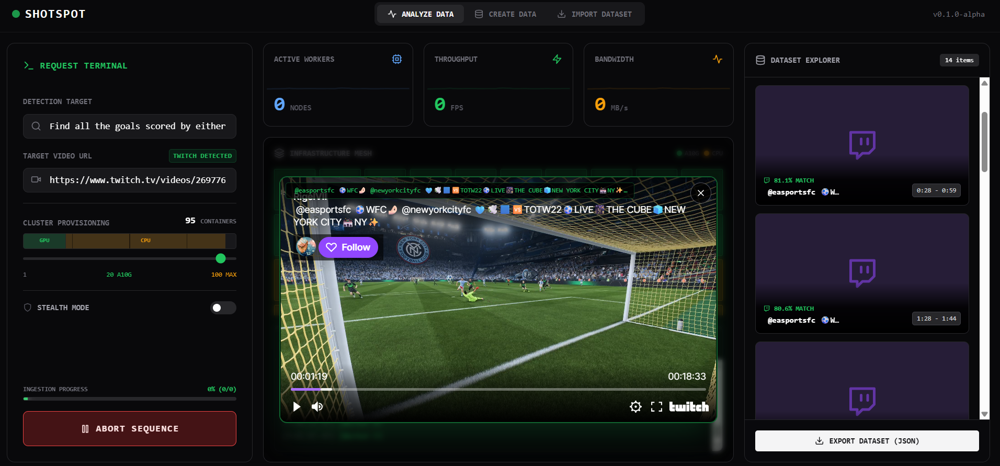
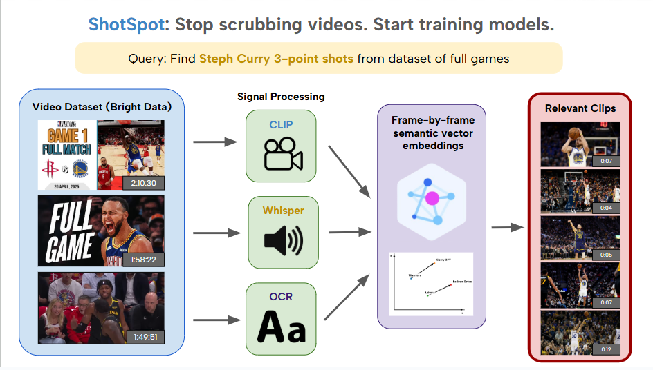

## What if you could search video like you search text?

## Inspiration

Training computer vision models shouldn't require thousands of hours manually scrubbing through video footage. When we started building AI models for sports analytics, we discovered that **data collection and cleaning consumed 70-80% of our development time**, the true bottleneck in deploying real-world AI solutions. A researcher looking for "Steph Curry three-pointers" would need to watch hundreds of hours of game footage, manually looking through marked timestamps frame by frame.

ShotSpot was born from this frustration. We wanted to democratize AI development by eliminating the tedious manual work, allowing researchers, developers, and even non-technical users to generate high-quality training datasets in minutes instead of months.

## What it does

ShotSpot is an **intelligent video data collection platform** that transforms how teams build computer vision datasets. Instead of manually scrubbing through hours of footage, users simply type what they're looking for, and our platform finds it and returns timestamps from specific videos.

### Core Features

**1. Multi-Modal Semantic Search**
- Analyzes every frame using **OpenAI's CLIP** for visual understanding
- Processes audio with **OpenAI's Whisper** for contextual accuracy
- Extracts on-screen text via **EasyOCR** for complete semantic coverage
- Combines all three signals with weighted cosine similarity scoring

**2. Flexible Input Methods**
- **Upload datasets**: Provide your own spreadsheet of video links
- **Individual videos**: Submit specific URLs to analyze
- **Zero-input mode**: Let Bright Data automatically discover and curate relevant videos based on your query

**3. Automated Dataset Generation**
- Query: *"Steph Curry three-point shots"*
- **Bright Data** searches and collects relevant highlight reels
- ShotSpot processes videos and returns **timestamped clips** matching your query
- Export ready-to-use training datasets with precise frame-level annotations

**4. Production-Ready Infrastructure**
- **Modal**: GPU-accelerated processing scaled automatically
- **MongoDB Atlas**: Vector embeddings stored with semantic search indexing
- **FastAPI backend**: RESTful API for programmatic access
- **Responsive web interface**: Intuitive UI accessible to non-developers

### Architecture

**Frontend**
- Modern web interface built for researchers and ML engineers
- Real-time progress tracking with WebSocket connections
- Drag-and-drop dataset and url uploads
- Interactive clip preview and export

**Backend (FastAPI + MongoDB)**
- RESTful API handling video processing jobs
- MongoDB Atlas with vector search indexes for semantic retrieval
- Background task queues for long-running video analysis
- Secure authentication and dataset management

**AI Processing Pipeline (Modal + GPU)**
- **CLIP embeddings**: Extract 512-dimensional vectors for every moment
- **Whisper transcription**: Process audio streams for contextual understanding
- **OCR detection**: Tesseract-based text extraction from frames
- **Fusion algorithm**: Weighted averaging of visual, audio, and text embeddings
- All models run on Modal's serverless GPU infrastructure for instant scaling

**Data Collection (Bright Data Integration)**
- **Web Scraper API**: Automatically discover YouTube videos matching user queries
- **SERP API**: Search capabilities for video content across platforms
- **MCP Integration**: LLM-powered query understanding for intelligent dataset curation

### Technical Workflow

We run an interconnected pipeline of models to preprocess embeddings for indexing videos. Regularly sampled image frames are fed to the visual encoder of CLIP to generate embeddings based on visual information. We also perform OCR to pull relevant textual information. Audio data is split into segments and piped through the Whisper model to generate transcriptions. These are concatenated with OCR results and fed into the textual encoder of CLIP. This embedding is summed and renormalized with the previous visual embeddings to gain a multimodal semantic representation of each moment, which is stored in MongoDB.

User search queries are similarly encoded through CLIP, and the resulting embedding is used to evaluate candidates through cosine similarity. We merge temporally close moments and return timestamped results per video.

Through Modal, we are able to process large datasources of videos by scaling the number of containers and distributing video analysis.

## Challenges we ran into

**1. Balancing Speed vs. Accuracy**
- Processing every frame of a 2-hour game at 30fps = 216,000 frames
- **Solution**: Adaptive frame sampling based on scene change detection, reducing processing while maintaining accuracy

**2. Minimizing False Positives**
- Single-modal approaches had 30-40% false positive rates
- **Solution**: Multi-modal fusion (CLIP + Whisper + OCR) reduced false positives while keeping false negatives low as well

**3. Handling Big Data at Scale**
- GB-sized videos overwhelmed traditional processing pipelines
- **Solution**: Modal's serverless GPU infrastructure auto-scales, processing 50+ concurrent videos without performance degradation

**4. Real-time WebSocket Communication**
- Users needed live progress updates without blocking backend
- **Solution**: Asynchronous task queues with WebSocket event streaming

## Accomplishments that we're proud of

- **Built a working system in 36 hours** – from concept to a platform capable of ingesting videos and analyzing them

- **Multi-product Bright Data integration** – Web Scraper API, SERP API, and Web Unlocker working seamlessly

- **Low false positive rate** – Multi-modal fusion achieves research-grade accuracy

- **Handles any input type** – Whether users have datasets, individual links, or nothing at all

- **Non-technical accessible** – UI designed for researchers without programming experience

- **Proven impact**: What took our team **2 weeks to collect manually** now takes **15 minutes**

## What we learned

**Technical Deep Dives**
- Managing vector embeddings at scale with MongoDB Atlas Vector Search
- Optimizing GPU utilization on Modal for cost-effective processing
- Real-time WebSocket architecture for long-running video jobs
- Multi-modal AI fusion techniques for improved accuracy

**User-Centered Design**
- Building intuitive interfaces for complex ML workflows
- Abstracting technical complexity without sacrificing power-user features
- Importance of progress indicators for long-running tasks

**Big Data Engineering**
- Efficient video streaming and processing pipelines
- Balancing accuracy vs. computational cost
- Handling diverse video formats, resolutions, and codecs

## What's next for ShotSpot

### 1. **Temporal Context Understanding**
- **Current**: Frame-by-frame analysis treats each frame independently
- **Implementation**: Add LSTM/Transformer layers to understand action sequences (e.g., "full three-point shot motion" not just "ball in air")
- **Impact**: 15-20% accuracy improvement for complex multi-frame actions

### 2. **Active Learning Pipeline**
- **Current**: Static model without user feedback
- **Implementation**: Users can mark incorrect clips, triggering model fine-tuning on Modal GPUs using their corrections as training data
- **Impact**: Personalized models achieving 99%+ accuracy for specific use cases

### 3. **Enterprise Team Features**
- **Current**: Individual user accounts
- **Implementation**: 
  - Shared dataset libraries with role-based access control
  - API keys for CI/CD integration
  - Usage analytics and cost tracking dashboards
  - Webhook notifications for completed jobs
- **Impact**: Enable ML teams to standardize their data collection workflow, reducing time-to-model by 60%

## Impact & Vision

ShotSpot addresses a **$2.7B market opportunity** in computer vision data labeling. By automating video data collection:

- **Time savings**: 95% reduction in manual dataset curation time
- **Cost savings**: $50-100/hour human labeling → $5-10 automated processing
- **Accessibility**: Democratizes AI development for researchers without data engineering teams

Our vision: **Make video data as searchable and accessible as text**, enabling the next generation of computer vision applications.